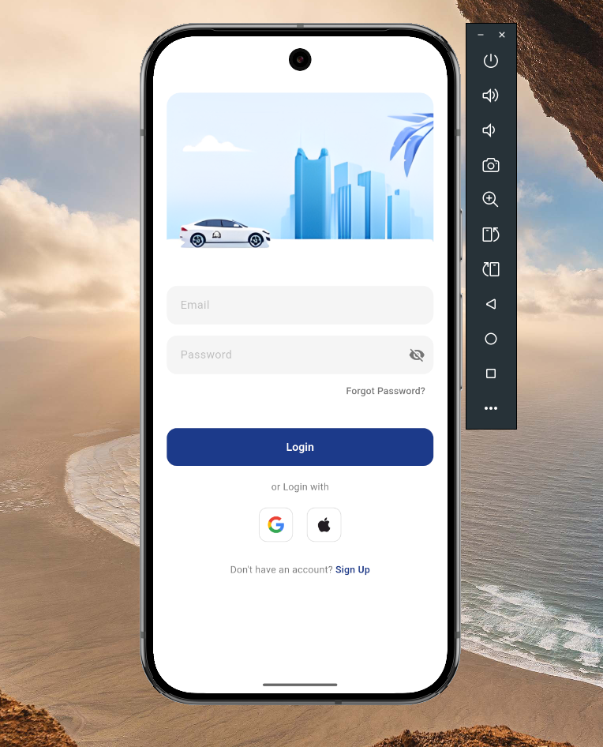

# my

A new Flutter project.

## Getting Started

This project is a starting point for a Flutter application.

A few resources to get you started if this is your first Flutter project:

- [Lab: Write your first Flutter app](https://docs.flutter.dev/get-started/codelab)
- [Cookbook: Useful Flutter samples](https://docs.flutter.dev/cookbook)

For help getting started with Flutter development, view the
[online documentation](https://docs.flutter.dev/), which offers tutorials,
samples, guidance on mobile development, and a full API reference.

//-------------------------------------------------------------------------
----<Notes>---

# Firebase Authentication with Flutter

A Flutter project implementing Firebase Authentication with Google Sign-In and Email/Password login.

## Setup Guide

Follow these steps to set up this project with your own Firebase account:

### 1. Firebase Setup
1. Go to [Firebase Console](https://console.firebase.google.com/)
2. Click "Create a project" or "Add project"
3. Enter your project name
4. Follow the setup wizard (enable Google Analytics if you want)

### 2. Flutter Project Setup
1. Clone this repository
2. Open the project in your preferred IDE (VS Code/Android Studio)
3. Run in terminal:
   ```bash
   flutter pub get
   ```

### 3. Configure Firebase in Your Project
1. In Firebase Console:
   - Click on your project
   - Click the Android icon (🤖) to add an Android app
   - Enter your package name (found in android/app/build.gradle)
   - Download `google-services.json`
   - Place it in `android/app/`

### 4. Enable Authentication Methods
1. In Firebase Console:
   - Go to Authentication → Sign-in methods
   - Enable "Email/Password"
   - Enable "Google"
   - Add your support email for Google Sign-in

### 5. Set Up Google Sign-In
1. Get your SHA-1:
   ```bash
   cd android
   ./gradlew signingReport
   ```
2. Add SHA-1 to Firebase:
   - Project Settings → Your Apps → Android app
   - Add fingerprint
   - Paste your SHA-1

### 6. Configure Firestore Database
1. Create Firestore Database:
   - Go to Firestore Database
   - Click "Create Database"
   - Start in test mode
   - Choose location closest to your users

2. Set Security Rules:
   ```javascript
   rules_version = '2';
   service cloud.firestore {
     match /databases/{database}/documents {
       match /{document=**} {
         allow read, write: if request.auth != null;
       }
     }
   }
   ```

### 7. Update Firebase Options
1. Install Firebase CLI:
   ```bash
   npm install -g firebase-tools
   ```
2. Install FlutterFire CLI:
   ```bash
   dart pub global activate flutterfire_cli
   ```
3. Configure Firebase:
   ```bash
   flutterfire configure
   ```
4. Select your project and platforms

### 8. Run the App
```bash
flutter run

//-------------------------------------------------------------------------

### 9. Configure Android Build Files

1. In `android/build.gradle`, add to `buildscript` → `dependencies`:
   ```gradle
   buildscript {
       dependencies {
           // Add this line
           classpath 'com.google.gms:google-services:4.4.1'
       }
   }
   ```

2. In `android/app/build.gradle`:
   ```gradle
   // Add these at the top
   apply plugin: 'com.android.application'
   apply plugin: 'kotlin-android'
   apply plugin: 'com.google.gms.google-services'

   android {
       namespace "com.example.my"  // Your package name
       compileSdkVersion 34

       defaultConfig {
           applicationId "com.example.my"  // Your package name
           minSdkVersion 21
           targetSdkVersion 34
           versionCode 1
           versionName "1.0"
       }
   }

   dependencies {
       // Import the Firebase BoM
       implementation platform('com.google.firebase:firebase-bom:32.7.1')

       // Firebase dependencies
       implementation 'com.google.firebase:firebase-analytics'
       implementation 'com.google.firebase:firebase-auth'
       implementation 'com.google.firebase:firebase-firestore'
       
       // Add the Google Play Services dependency
       implementation 'com.google.android.gms:play-services-auth:20.7.0'
   }
   ```

3. In `android/app/src/main/AndroidManifest.xml`:
   ```xml
   <manifest>
       <uses-permission android:name="android.permission.INTERNET"/>
       <application
           android:name="${applicationName}"
           android:label="Your App Name"
           android:icon="@mipmap/ic_launcher">
           <!-- ... rest of your manifest ... -->
       </application>
   </manifest>
   ```

### 10. Dependencies in pubspec.yaml
Add these dependencies to your `pubspec.yaml`:
```yaml
dependencies:
  flutter:
    sdk: flutter
  firebase_core: ^2.24.2
  firebase_auth: ^4.15.3
  google_sign_in: ^6.1.6
  cloud_firestore: ^4.13.6
  get: ^4.6.6
  sign_in_with_apple: ^5.0.0
  crypto: ^3.0.3
```

After adding dependencies:
```bash
flutter pub get
```

### Common Build Issues

1. **Gradle Sync Failed**
   - Try updating Gradle version in `android/gradle/wrapper/gradle-wrapper.properties`:
     ```properties
     distributionUrl=https\://services.gradle.org/distributions/gradle-7.5-all.zip
     ```
   - Run:
     ```bash
     cd android
     ./gradlew clean
     cd ..
     flutter clean
     flutter pub get
     ```

2. **Version Conflicts**
   - If you see version conflicts, make sure your `build.gradle` files are using compatible versions
   - Update Google Services plugin version if needed
   - Check Firebase BOM version is current

3. **Minimum SDK Version Error**
   - If you get minimum SDK version errors, ensure your `android/app/build.gradle` has:
     ```gradle
     minSdkVersion 21
     ```

4. **Missing google-services.json**
   - Double-check that `google-services.json` is in `android/app/`
   - Make sure it's from your Firebase project
   - Verify package name matches your app's package name

//--------------------------------------------------------------------------------------

## 🔍 Required Changes Checklist

### 1. Package Name Changes
- [ ] In `android/app/build.gradle`:
  ```gradle
  android {
      namespace "your.package.name"  // Change this
      defaultConfig {
          applicationId "your.package.name"  // Change this
      }
  }
  ```

### 2. Firebase Configuration Files
- [ ] Replace `android/app/google-services.json` with your own file from Firebase Console
- [ ] Update `lib/firebase_options.dart` (will be generated by flutterfire configure)

### 3. Application Files to Check
- [ ] `lib/main.dart`
  - Verify Firebase initialization
  - Check route names match your setup

- [ ] `lib/controllers/auth_controller.dart`
  - Update error messages if needed
  - Verify navigation routes

- [ ] `lib/services/database_service.dart`
  - Check collection names match your database structure
  - Verify field names in user data

- [ ] `lib/screens/auth/login_screen.dart`
  - Update UI text/branding
  - Check navigation routes

- [ ] `lib/screens/auth/signup_screen.dart`
  - Update UI text/branding
  - Verify form fields match your needs

- [ ] `lib/screens/home_screen.dart`
  - Customize UI for your needs
  - Update user data display

### 4. AndroidManifest.xml
- [ ] Update in `android/app/src/main/AndroidManifest.xml`:
  ```xml
  android:label="Your App Name"  // Change this
  ```

### 5. Dependencies in pubspec.yaml
- [ ] Verify versions in `pubspec.yaml` match your needs:
  ```yaml
  firebase_core: ^2.24.2
  firebase_auth: ^4.15.3
  google_sign_in: ^6.1.6
  cloud_firestore: ^4.13.6
  get: ^4.6.6
  sign_in_with_apple: ^5.0.0
  crypto: ^3.0.3
  ```

### 6. Run Configuration Commands
```bash
flutter clean
flutter pub get
cd android
./gradlew clean
cd ..
flutter run
```

> **Note**: Files marked with 🔄 require mandatory changes for the app to work with your Firebase project.
> Files marked with ⚙️ might need customization based on your needs.

//--------------------------------------------------------------------------------------
//------Sample UI--------//

